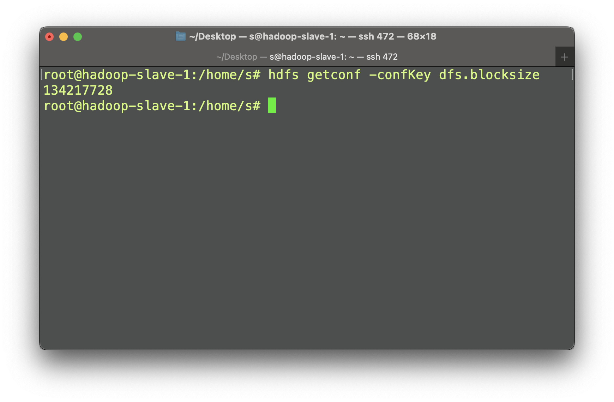
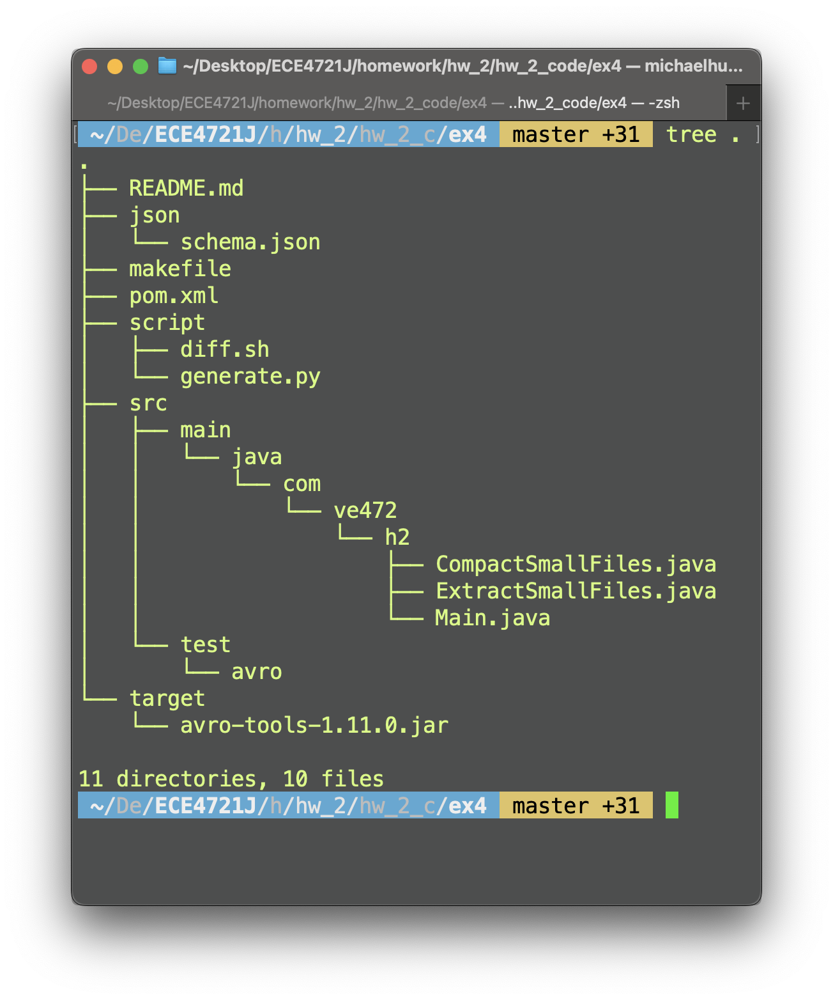

# Ex. 1 - Preparation

## 1. Adjust your program from lab 2 exercise 2 to generate many small `csv` files.
::: warning

Please refer to `hw_2_code/ex1/README.md`.

:::

## 2. Find the block size on your Hadoop installation, and explain how you did it.

::: info

```bash
hdfs getconf -confKey dfs.blocksize
```



:::

# Ex. 2 - Filecrush^[[Github](https://github.com/edwardcapriolo/filecrush)]

## 1. Read the documentation and briefly explain how we would need to use it in our case.

::: info

Crush consumes directories containing many small files with the same key and value types and creates fewer, larger files containing the same data. We can use `Filecrush` to combine small `csv` files together into larger files for future process.

:::

## 2. Try to run it on Hadoop with the following options. Explain each the used options.

::: info

```bash
hadoop jar filecrush/target/filecrush-2.2.2-SNAPSHOT.jar com.m6d.filecrush.crush.Crush -Dfs.block.size=128000000 --input-format text --clone --output-format sequence --compress gzip data/ data/out/ 20220602172400
```

Synopsis

```bash
Crush [OPTION]... <input dir> <output dir> <timestamp>
```

Arguments

1. `-Dfs.block.size`: Specify dfs file size
2. `--clone`: Use clone mode. Useful for external Hive tables. In clone mode, the small files are replaced with the larger files. The small files are moved to a subdirectory of the output dir argument. The subdirectory is same as the original directory rooted at output dir.
3. `--compress`: Fully qualified class name of the compression codec to use when writing data. It is permissible to use "none" and "gzip" to indicate no compression and `org.apache.hadoop.io.compress.GzipCodec`, respectively.
4. `--input-format`: Fully qualified class name of the input format for the data in a directory. Can use the "text" and "sequence" shortcuts for `org.apache.hadoop.mapred.TextInputFormat` and `org.apache.hadoop.mapred.SequenceFileInputFormat`, respectively. Defaults to sequence if no directory options are specified.
5. `--output-format`: Fully qualified class name of the output format to use when writing the output file for a directory.

:::

## Depending on the success or failure, explain what happened.
::: error
It fails. Source files don't compile on my server due to packages' version.
:::

# Ex. 3 - S3DistCp^[[AWS](https://docs.aws.amazon.com/emr/latest/ReleaseGuide/UsingEMR_s3distcp.html)]
::: info

When `--groupBy` is specified, only files that match the specified pattern are copied. Thus we can use
```bash
--groupBy=grades_[0-9]+\.csv
```

We also need:

1. `--src=LOCATION` to specify location of the data to copy
2. `--dest=LOCATION` to specify destination for the data.

We can use S3DistCp to copy our small file to HDFS, and at the same time, concatenate file use `--groupBy` option to merge the small csv files into a single large one before using `Hadoop` to do mapreduce.

:::

# Ex. 4 - Avro^[[Apache](https://avro.apache.org/)]

::: warning

Please refer to `ex4/README.md` for detailed usage

:::

## 1.b What is the Snappy codec and when is it best used?

::: info

\qquad Snappy is a compression/decompression library. It does not aim for maximum compression, or compatibility with any other compression library; instead, it aims for very high speeds and reasonable compression. For instance, compared to the fastest mode of zlib, Snappy is an order of magnitude faster for most inputs, but the resulting compressed files are anywhere from 20% to 100% bigger. ^[[Github](https://github.com/google/snappy)]

:::

## 2/3/4. Detail Implmentation
::: info

The initial file structure should be as follows:

{width=90%}

Please don't modify the file structure manually, the build/run/diff pipeline is implemented in `makefile`

:::