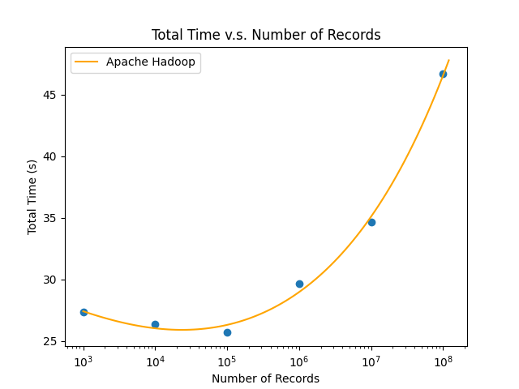
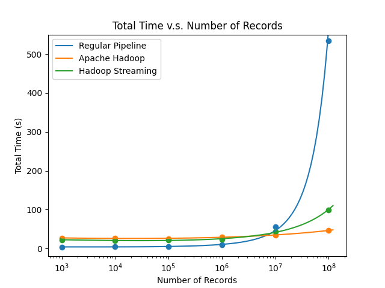
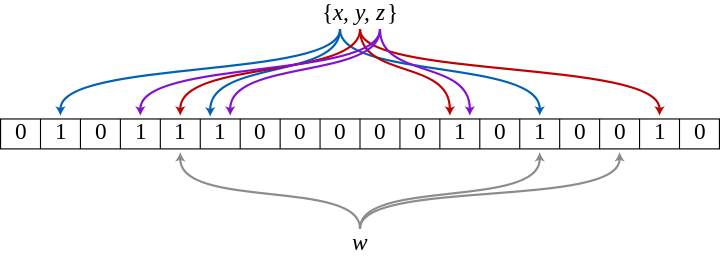

# Ex.1 MapReduce

::: warning

Please Refer to `hw_3_code/ex1/README.md`

:::


::: info

## 4. Benchmark

{width=66%}

{width=66%}

:::

# Ex.2 Avro

## 1. Three ways or API styles of Avro in MapReduce^[[Patterson Consulting](http://www.pattersonconsultingtn.com/blog/avro_101_w_kafka.html)] ^[[icircuit](https://icircuit.net/avro-reflect-api-example/1510)]

::: info

**Avro SpecificRecords**:

  \quad SpecificRecord Avro bindings make use of classes that are generated from your schema specifications with the Maven Avro Plugin. These generated classes allow us to manage the fields in our Avro schema using getter and setter methods in the code in our Kafka application, making programming feel a bit more familiar. This API offers static compile time type safety checks and provides integrity for using correct field names and datatypes. We see the SpecificRecord API used for most RPC uses and for data applications that always use the same datatypes.

\quad

**Avro GenericRecords**:

  \quad The Avro GenericRecord binding is a general-purpose binding which indentifies fields to be read and written by supplying a simple string that names the field. Generic record bindings provide the widest support for the Avro data types, which is helpful if your store has a constantly expanding set of schema. For data applications that accept dynamic datatypes where the schema is not known until runtime the Avro GenericRecord API is recommended. The advantage with this approach is it allows us to use the binding in a generic manner but also suffers from a lack of type safety at application compile time.

\quad

**Avro ReflectData**:

  \quad The advantage of the reflect API is that we don’t have to define a schema. We can simply generate a schema from the existing type. For example we have a student class, we can generate a schema using the following code:

  ```java
  Schema schema=ReflectData.get().getSchema(Student.class);
  ```
  Then, we can use the `ReflectDatumWriter` to get a writer and pass the schema or the class to the constructor of the writer. Once we have the writer, writing the data to the file (marshaling or serializing) is same as with the Generic API.

:::

## 2. MapReduce with Avro file

::: warning

Please Refer to `hw_3_code/ex1/README.md`

:::

# Ex.3 Bloom filters

## 1. Describe what a Bloom filter is and how it works.

::: info

\quad A Bloom filter is a space-efficient probabilistic data structure, conceived by Burton Howard Bloom in 1970, that is used to test whether an element is a member of a set. False positive matches are possible, but false negatives are not – in other words, a query returns either "possibly in set" or "definitely not in set".

\quad

\quad Bloom proposed the technique for applications where the amount of source data would require an impractically large amount of memory if "conventional" error-free hashing techniques were applied.

- An empty Bloom filter is a bit array of m bits, all set to 0.
- Define k different hash functions, each of which maps or hashes some set element to one of the m array positions, generating a uniform random distribution. (Typically, k is a small constant which depends on the desired false error rate ε, while m is proportional to k and the number of elements to be added.)
- To **add** an element, feed it to each of the k hash functions to get k array positions. Set the bits at all these positions to 1.
- To **query** for an element (test whether it is in the set), feed it to each of the k hash functions to get k array positions:
  - If any of the bits at these positions is 0, the element is definitely not in the set; If it were, then all the bits would have been set to 1 when it was inserted.
  - If all are 1, then either the element is in the set, or the bits have by chance been set to 1 during the insertion of other elements, resulting in a false positive. In a simple Bloom filter, there is no way to distinguish between the two cases, but more advanced techniques can address this problem.

{width=75%}

:::

## 2. Using the BloomFilter class write a mapper which creates a Bloom filter.

::: info


:::