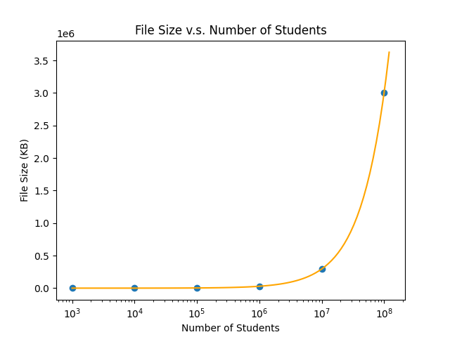
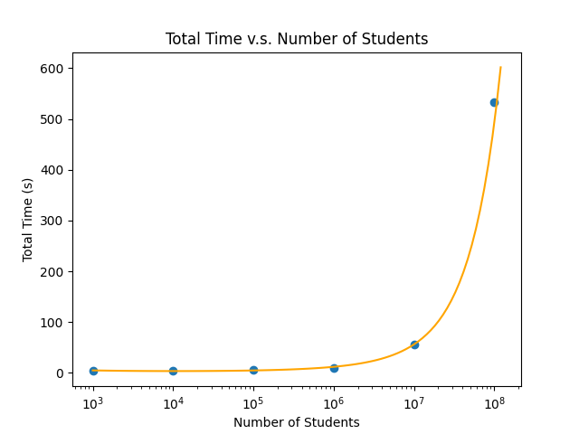
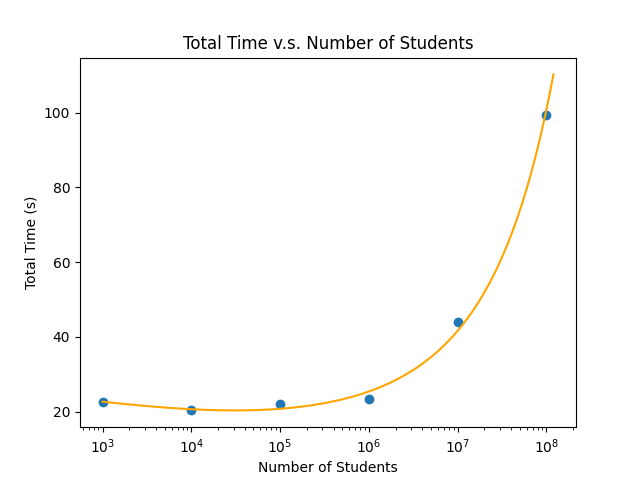
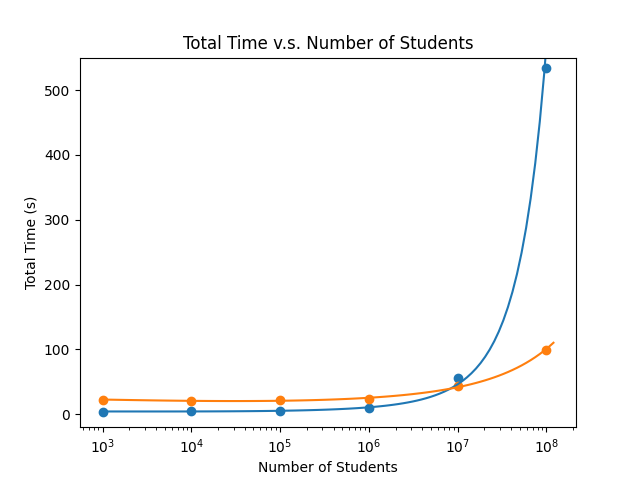

# 1. Input File Generation

We first randomly 1000 students with  `generate.py`. Then we use `grading.sh ` and `grading.awk` to randomly assign student ID and grades for these 1000 students, with each student randomly appear a number of times depending on the input data size. The input files we used are as follows,

| Number of students | File Size |
| :----------------: | :-------: |
|      1000          |  29 KB    |
|      10000         |  287 KB   |
|      100000        |  2.8 MB   |
|      1000000       |  28.7 MB  |
|      10000000      |  286.9 MB |
|      100000000     |  2.87 GB  |

{width=80%}

# 2. Performance on a single computer

The CPU of the computer used in this session is 2.3 GHz Dual-Core Intel Core i5 and the RAM is 8 GB.

The command used is listed in the last section of this report. A sample output is attached as well.

The speed (total time in the unit of seconds) versus the number of student and the size of the file is as follows,

| Number of students | File Size | Total Time (s) |
| :----------------: | :-------: | :------------: |
|      1000          |  29 KB    |     4.088      |
|      10000         |  287 KB   |     4.826      |
|      100000        |  2.8 MB   |     5.189      |
|      1000000       |  28.7 MB  |     8.904      |
|      10000000      |  286.9 MB |     55.917     |
|      100000000     |  2.87 GB  |     534        |

{width=80%}

# 3. Performance on the group cluster

The Apache Hadoop is a framework supporting the distributed processing of large data sets across clusters of computers, which takes advantage of the MapReduce programming model that processes and generates big data sets with distributed algorithm on a cluster. MapReduce mainly consists of:

- Mapper: takes splitted input from the disk as `<key,value>` pairs, processes them, and produces another intermediate `<key,value>` pairs as output.
- Reducer: takes `<key,value>` pairs with the same key, aggregates the values, and produces new useful `<key,value>` pairs as output.

{width=70%}

With Hadoop cluster set up, we have 1 master and 2 slave for MapReduce tasks. The speed (total time in the unit of seconds) versus the number of student and the size of the file is as follows,

| Number of students | File Size | Total Time (s) |
| :----------------: | :-------: | :------------: |
|      1000          |   29 KB   |      22.6      |
|      10000         |  287 KB   |      20.3      |
|      100000        |  2.8 MB   |      22.0      |
|      1000000       |  28.7 MB  |      23.3      |
|      10000000      | 286.9 MB  |      44.0      |
|      100000000     |  2.87 GB  |      99.3      |

{width=72%}

{width=72%}

We can find that Hadoop MapReduce is much more efficient for big data.

# 4. Hadoop MapReduce Configuration
## a. Generate Data

Script `generate.py` generates `csv` file contains random names, studentsID and grades.

- Run: `$ python3 generate.py <number of lines>`
  - e.g. `python3 generate.py 100`
- Python module: `names`, `random`
- Input: None
- Output: create directory `data/` and generate `grades_100.csv`
  - Format: `<name>,<studentID>,<grade>`
  - e.g. `Michael Huang,0123456789,90`

### Code for `generate.py`

```python
#!/usr/bin/python3

import os
import sys
import random
import names

DATA_NUMBER = 300
if (len(sys.argv) < 2):
    print("Usage: generate.py <number of lines>")
    exit(1)
LINE_NUMBER = int(sys.argv[1])
BASE_DIR = "data/"

id = set()
firstnames = set()
lastnames = set()


def generate_raw():

    for _ in range(DATA_NUMBER):
        id.add(random.randint(1000000000, 9999999999))

    for _ in range(DATA_NUMBER):
        firstnames.add(names.get_first_name())

    for _ in range(DATA_NUMBER):
        lastnames.add(names.get_last_name())

    if (not os.path.exists(BASE_DIR)):
        os.makedirs(BASE_DIR)


def generate_csv():
    first = list(firstnames)
    last = list(lastnames)
    ID = list(id)
    with open(os.path.join(BASE_DIR, "grades_{}.csv".format(LINE_NUMBER)), 'w') as f:
        for i in range(LINE_NUMBER):
            rand = random.randint(0, min(len(first), len(last), len(ID))-1)
            grade = random.randint(0, 100)
            f.write("{} {},{},{}\n".format(
                first[rand], last[rand], ID[rand], grade))


if "__main__" == __name__:
    generate_raw()
    generate_csv()

```

## b. Mapper

Mapper reads `stdin` with name, studentID & grade separated by newline, and returns the tab-separated pair: `studentID<TAB>grade`

- Run: `$ ./mapper.sh`
- Input: `stdin` (e.g `Michael Huang,0123456789,100`)
- Output: `stdout` (e.g `0123456789<TAB>100`)
- Test: Use input redirection to read from file `grades.csv`

### Code for `mapper.sh`

```bash
#!/bin/bash
# Reads STDIN with name, studentID and grades separated by newline
# Returns the tab-separated pair: studentID<TAB>grade
# Input:
#    STDIN: Michael Huang,0123456789,100
# Output:
#    STDOUT: 0123456789<TAB>100

awk -F, '{print $2"\t"$3}'

```

## c. Reducer

Reducer reads tab-separated pairs from the standard input, each of which is composed of a studentID and a grade, and returns the max grade for each student on the standard output.

- Run: `$ ./reducer.sh`
- Input: `stdin` (e.g. `0123456789<TAB>80 ... 0123456789<TAB>100`)
- Output: `stdout` (e.g. `0123456789 100`)

### Code for `reducer.py`

```python
#!/usr/bin/python3
# coding:utf-8

# Reads pairs from the standard input. Each tab-separated pair is composed of a studentID and a list of grades
# Returns the max grade for each student on the standard output.
# Input:
#    StudentID<TAB>Grade1
#    StudentID<TAB>Grade2
#    ...
# Output:
#    StudentID Max(Grade1, Grade2, ...)


import sys


def reduce():

    roster = {}

    # build roster
    line = sys.stdin.readline()
    while line:
        entry = line.split()
        ID = entry[0]
        grade = int(entry[1])
        roster.setdefault(ID, []).append(grade)
        line = sys.stdin.readline()

    # find max grade
    for ID in sorted(roster.keys()):
        print("{} {}".format(ID, max(roster[ID])))


if "__main__" == __name__:
    reduce()

```

## d. Single Task

Single task cascades mapper and reducer with pipe.

- Run: `$ ./mapper.sh < grades_100.csv | ./reducer`
- Benchmark: use `time` command to calculate time elapsed

## e. Hadoop Cluster

### 1) HDFS

```bash
hdfs dfs -ls <dir_in_hdfs>
hdfs dfs -mkdir <dir_in_hdfs>
hdfs dfs -put <file_in_your_system> <dir_in_hdfs>
hdfs dfs -get <file_in_hdfs>
hdfs dfs -rm -r -f output
```

You can check via Utilities->Browse file system in `localhost:9870` to check the directory and files on the hdfs.

### 2) Streaming

In your hadoop home directory, run streaming with package: `share/hadoop/tools/lib/hadoop-streaming-3.3.2.jar` via the following command after you have created directory in `hdfs` for `<DFS_INPUT_DIR>` and `<DFS_OUTPUT_DIR>`

```bash
hadoop jar <HADOOP_HOME>/share/hadoop/tools/lib/hadoop-streaming-3.3.2.jar -input <DFS_INPUT_DIR> -output <DFS_OUTPUT_DIR> -mapper <MAPPER> -reducer <REDUCER> -file <LOCAL_MAPPER_DIR>  -file <LOCAL_REDUCER_DIR>
```

*Notes:*

- <MAPPER> and <REDUCER> can be local files, while <DFS_INPUT_DIR> and <DFS_OUTPUT_DIR> is in `hdfs`
- `<DFS_OUTPUT_DIR>` needs to be emptyed everytime re-running the MapReduce task

*Error Handling:*

- Check `<HADOOP_HOME>/logs` for detailed logs
- `WARN org.apache.hadoop.streaming.PipeMapRed: java.io.IOException`
  - Check if `#!/usr/bin/env python` is included if you are using `python`
  - Check if shell scripts are granted permission to execute
  - Check if shell scripts handle the exception correctly

## f. Benchmark

### 1) Run Hadoop MapReduce Tasks

- Path:  `root@hadoop-master:/home/s/lab2_benchmark`
- Command

  ```bash
  $ chmod +x ./benchmark.sh
  $ ./benchmark.sh
  ```

- Input: put `grades_#.csv` into `input/`
- Output: `/log/time.log` containing task time in seconds
- Effect:
  1. copy the `csv` files in `input/` to `hdfs`
  2. For each file in `input/`:
     - Run MapReduce tasks
     - Calculate time used in seconds
  3. Generate a log file `time.log` in `log/`

### 2) Scatter and fitting Plot

- Run: `$ python3 plot.py`
- Ouput: plots saved to `img/`

### Code for `benchmark.sh`

```bash
#!/bin/bash
# run this script on root@hadoop-master:/home/s/lab2_benchmark

mkdir -p output
mkdir -p log

# delete hdfs input/lab2
hdfs dfs -rm -r -f input/lab2

# copy input to hdfs
mv input/ lab2/
hdfs dfs -put lab2/ input/
mv lab2/ input/

rm -f log/time.log

for ((NUM=1000;NUM<=100000000;))
do
    hdfs dfs -rm -r -f output/
    cd /home/s/hadoop

    start=$SECONDS

    hadoop jar share/hadoop/tools/lib/hadoop-streaming-3.3.2.jar -input input/lab2/grades_$NUM.csv -output output -mapper /src/mapper.sh -reducer "python reducer.py" -file /src/mapper.sh  -file /src/reducer.py

    end=$SECONDS

    cd /home/s/lab2_benchmark
    hdfs dfs -get output/part-00000
    mv part-00000 output/$NUM.out

    duration=$(($end - $start))
    echo $NUM: $duration >> log/time.log

    ((NUM=$NUM*10))
done

```

### Code for `plot.py`

```python
import os
import numpy as np
import matplotlib.pyplot as plt

BASE_DIR = "img/"

START_EXPONENT = 3
STOP_EXPONENT = 8

############################### Single ###############################
# Total Time v.s. Number of Students
student_num = [10**i for i in range(START_EXPONENT, STOP_EXPONENT+1)]
total_time = [4.088, 4.826, 5.189, 8.904, 55.917, 534]

coeffs = np.polyfit(np.log(student_num), np.log(total_time), deg=2)
poly = np.poly1d(coeffs)

x = np.logspace(START_EXPONENT, 1.01*STOP_EXPONENT, 100)
y = np.exp(poly(np.log(x)))

plt.scatter(student_num, total_time)
plt.plot(x, y, 'orange')

plt.xscale('log')
plt.xlabel('Number of Students')
plt.ylabel('Total Time (s)')
plt.title('Total Time v.s. Number of Students')

plt.savefig(os.path.join(BASE_DIR, 'single.png'))
plt.clf()

# File Size v.s. Number of Students
file_size = [29, 287, 2.8*1024, 28.7*1024, 286.9*1024, 2.87*1024*1024]

coeffs = np.polyfit(np.log(student_num), np.log(file_size), deg=2)
poly = np.poly1d(coeffs)
y = np.exp(poly(np.log(x)))

plt.scatter(student_num, file_size)
plt.plot(x, y, 'orange')

plt.xscale('log')
plt.xlabel('Number of Students')
plt.ylabel('File Size (KB)')
plt.title('File Size v.s. Number of Students')

plt.savefig(os.path.join(BASE_DIR, 'file.png'))
plt.clf()

############################### Cluster ###############################
student_num = [10**i for i in range(START_EXPONENT, STOP_EXPONENT+1)]

total_time_1 = [25, 21, 21, 24, 47, 107]
total_time_2 = [21, 20, 22, 24, 40, 96]
total_time_3 = [22, 20, 23, 22, 45, 95]

total_time = []
for i in range(len(total_time_1)):
    total_time.append((total_time_1[i] + total_time_2[i] + total_time_3[i])/3)

coeffs = np.polyfit(np.log(student_num), np.log(total_time), deg=3)
poly = np.poly1d(coeffs)

x = np.logspace(START_EXPONENT, 1.01*STOP_EXPONENT, 100)
y = np.exp(poly(np.log(x)))

# Total Time v.s. Number of Students
plt.scatter(student_num, total_time)
plt.plot(x, y, 'orange')

plt.xscale('log')
plt.xlabel('Number of Students')
plt.ylabel('Total Time (s)')
plt.title('Total Time v.s. Number of Students')

plt.savefig(os.path.join(BASE_DIR, 'cluster.png'))
plt.clf()

############################### Both ###############################
student_num = [10**i for i in range(START_EXPONENT, STOP_EXPONENT+1)]

total_time_1 = [25, 21, 21, 24, 47, 107]
total_time_2 = [21, 20, 22, 24, 40, 96]
total_time_3 = [22, 20, 23, 22, 45, 95]

total_time_single = [4.088, 4.826, 5.189, 8.904, 55.917, 534]

total_time_cluster = []
for i in range(len(total_time_1)):
    total_time_cluster.append(
        (total_time_1[i] + total_time_2[i] + total_time_3[i])/3)

coeffs_cluster = np.polyfit(
    np.log(student_num), np.log(total_time_cluster), deg=3)
coeffs_single = np.polyfit(
    np.log(student_num), np.log(total_time_single), deg=3)
poly_cluster = np.poly1d(coeffs_cluster)
poly_single = np.poly1d(coeffs_single)


x = np.logspace(START_EXPONENT, 1.01*STOP_EXPONENT, 100)
y_cluster = np.exp(poly_cluster(np.log(x)))
y_single = np.exp(poly_single(np.log(x)))

# Total Time v.s. Number of Students
plt.plot(x, y_single)
plt.scatter(student_num, total_time_single)
plt.plot(x, y_cluster)
plt.scatter(student_num, total_time_cluster)

plt.ylim(-20, 550)
plt.xscale('log')
plt.xlabel('Number of Students')
plt.ylabel('Total Time (s)')
plt.title('Total Time v.s. Number of Students')

plt.savefig(os.path.join(BASE_DIR, 'benchmark.png'))
plt.clf()
```
