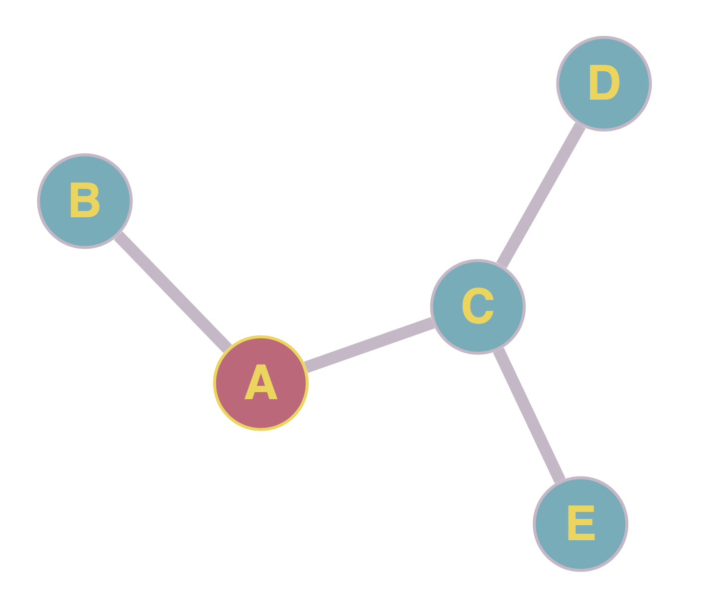

# Milestone 0: HDF5 Data Pre-process

## Goals

1. Compact small `hdf5` files into larger one

2. Read `hdf5` file and extract the information

3. Convert `hdf5` to `Avro` with `Apache Avro`

## 1. Compact small `hdf5` files into larger one

```bash
$ python3 create_aggregate_file.py <IN> <OUT>
```

- Input: a directory contains `hdf5` song files

- Output: an aggregate `hdf5` song file

- Example:

  

## 2. Read `hdf5` files and extract the information

```bash
$ python3 display_song.py [FLAGS] <HDF5> <idx> <field>
```

- Input: an `hdf5` song file

- Output: specified field content

- Example:

  

## 3. Convert `hdf5` to `Avro` with `Apache Avro`

```bash
$ hdf5_to_avro.py [-h] -s <SCHEMA> -i <HDF5> -o <AVRO>
```

- Input:

  - an `Avro` schema file

  - an `hdf5` song file to be converted

- Output: an `Avro` song file

## Sample schema file in `json` format:

```json
  {
    "namespace": "song.avro",
    "type": "record",
    "name": "Song",
    "fields": [
      {
        "name": "artist_name",
        "type": ["string", "null"]
      },
      {
        "name": "title",
        "type": ["string", "null"]
      }
    ]
  }
```

##

\br

{width=80%}

## Reference

1. MSongsDB

   [`https://github.com/tbertinmahieux/MSongsDB`](https://github.com/tbertinmahieux/MSongsDB)

2. MSongsDB Field List

   [`http://millionsongdataset.com/pages/field-list/`](http://millionsongdataset.com/pages/field-list/)

3. Apache Avro Documentation

   [`https://avro.apache.org/docs/current/index.html`](https://avro.apache.org/docs/current/index.html)

# Milestone 1: Drill Database Query

## Goals

Query [Million Song Dataset (MSD)](http://millionsongdataset.com) with `Drill`:

1. Find the range of dates covered by the songs in the dataset

2. Find the hottest song that is the shortest and shows highest energy with lowest tempo

3. Find the name of the album with the most tracks

4. Find the name of the band who recorded the longest song

## 1. The range of dates covered by the songs

- SQL:

  ```sql
  -- Age of the oldest songs
  SELECT 2022 - MAX(year) AS Age
  FROM hdfs.`/pj/m0/output.avro`;

  -- Age of the youngest songs
  SELECT 2022 - MIN(year) AS Age
  FROM hdfs.`/pj/m0/output.avro`
  WHERE year > 0;
  ```

## 1. The range of dates covered by the songs

- Results:

  ```log
  +--------+        +--------+
  |  Age   |        |  Age   |
  +--------+        +--------+
  | 12     |        | 96     |
  +--------+        +--------+
  1 row selected    1 row selected
  ```

\br

The oldest song's age is **96** and the youngest is **12**. As a result, the range of dates covered by the songs is **84** years.

## 2. The hottest song that is the shortest and shows highest energy with lowest tempo

- SQL:

    ```sql
    SELECT title
    FROM hdfs.`/pj/m0/output.avro`
    WHERE song_hotttnesss <> 'NaN'
    ORDER BY song_hotttnesss DESC,
        duration ASC,
        energy DESC,
        tempo ASC
    LIMIT 10;
    ```

- Remarks: This query returns **5648** results, but we only display the first **10** records.

## 2. The hottest song that is the shortest and shows highest energy with lowest tempo

```log
+------------------------------------------------------+
|                        title                         |
+------------------------------------------------------+
| b'Immigrant Song (Album Version)'                    |
| b"Nothin' On You [feat. Bruno Mars] (Album Version)" |
| b'This Christmas (LP Version)'                       |
| b'If Today Was Your Last Day (Album Version)'        |
| b'Harder To Breathe'                                 |
| b'Blue Orchid'                                       |
| b'Just Say Yes'                                      |
| b'They Reminisce Over You (Single Version)'          |
| b'Exogenesis: Symphony Part 1 [Overture]'            |
| b'Inertiatic Esp'                                    |
+------------------------------------------------------+
10 rows selected (0.471 seconds)
```

## 3. The name of the album with the most tracks

- SQL:

  ```sql
  SELECT release, COUNT(release) AS NumTrack
  FROM hdfs.`/pj/m0/output.avro`
  GROUP BY release
  ORDER BY NumTrack desc
  LIMIT 1;
  ```

- Results:

  ```log
  +------------------+----------+
  |     release      | NumTrack |
  +------------------+----------+
  | b'Greatest Hits' | 21       |
  +------------------+----------+
  1 row selected (0.695 seconds)
  ```

## 4. The name of the band who recorded the longest song

- SQL:

  ```sql
  SELECT artist_name, duration
  FROM hdfs.`/pj/m0/output.avro`
  ORDER BY duration DESC
  LIMIT 1;
  ```

- Results:

  ```log
  +-------------+-----------+
  | artist_name | duration  |
  +-------------+-----------+
  | b'UFO'      | 1819.7677 |
  +-------------+-----------+
  1 row selected (0.27 seconds)
  ```

# Milestone 2: Advanced Data Analysis

## Goals

1. Determine distance between artists with adjacency matrix, using parallelized BFS

2. Propose similar songs with distance and "provide more diverse recommendations"

3. Do it in both MapReduce and Spark to compare the time

4. Prepare a set of slides with Beamer and a poster with Beamerposter for presentations

## BFS with MapReduce

Runs BFS on the [MillionSongDataset](http://millionsongdataset.com/) to search for similar artists to a certain artist within distance 3 with MapReduce:

## BFS with MapReduce - A Simple Example

Let's say we want to find artists similar to **A** with distance **3**, and we have following relationships (each edge has distance **1**):

{width=65%}

## Step 1: Initialize Graph File with Target Artist

**Format**: each line contains **Node | Distance | Neighbours**

::: blank
::: columns

:::: {.column width=60% align=c}

::::

:::: {.column width=40% align=c}
::: info
```
A | 0   | B,C
B | inf | A
C | inf | A,E
D | inf | E,G
E | inf | C,D,F
F | inf | E
G | inf | D
```
:::
::::

:::
:::

## Step 2: Generate Distance Pair in Mapper

**Output**: each line contains **Neighbours, Node, Distance+1**

\br

::: {.columns align=center}
:::: {.column width=30%}
::: info
```
A|0  |B,C

B|inf|A
C|inf|A,E

D|inf|E,G

E|inf|C,D,F


F|inf|E
G|inf|D
```
:::
::::
:::: {.column width=10%}
$$\xrightarrow[]{\textbf{Mapper}}$$
::::
:::: {.column width=25%}
::: info
```
B, A, 1
C, A, 1
A, B, inf
A, C, inf
E, C, inf
E, D, inf
G, D, inf
C, E, inf
D, E, inf
F, E, inf
E, F, inf
D, G, inf
```
:::
::::
:::: {.column width=6%}
$$\xrightarrow[]{\textbf{Sort}}$$
::::
:::: {.column width=25%}
::: info
```
A, B, inf
A, C, inf
B, A, 1
C, A, 1
C, E, inf
D, E, inf
D, G, inf
E, C, inf
E, D, inf
E, F, inf
F, E, inf
G, D, inf
```
:::
::::
:::
